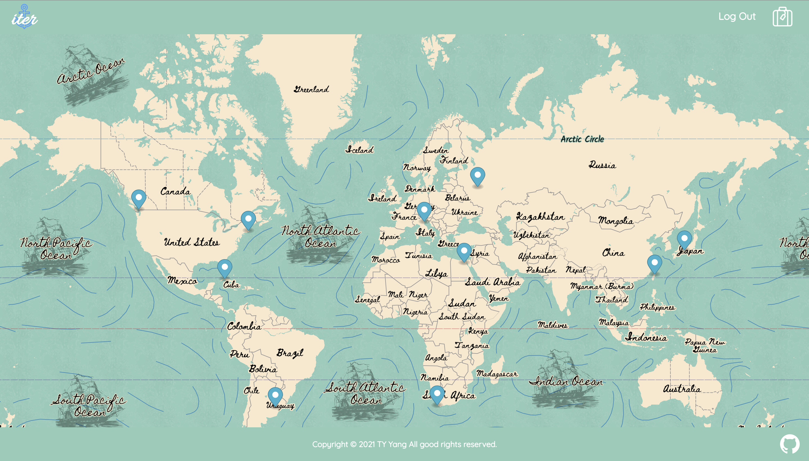
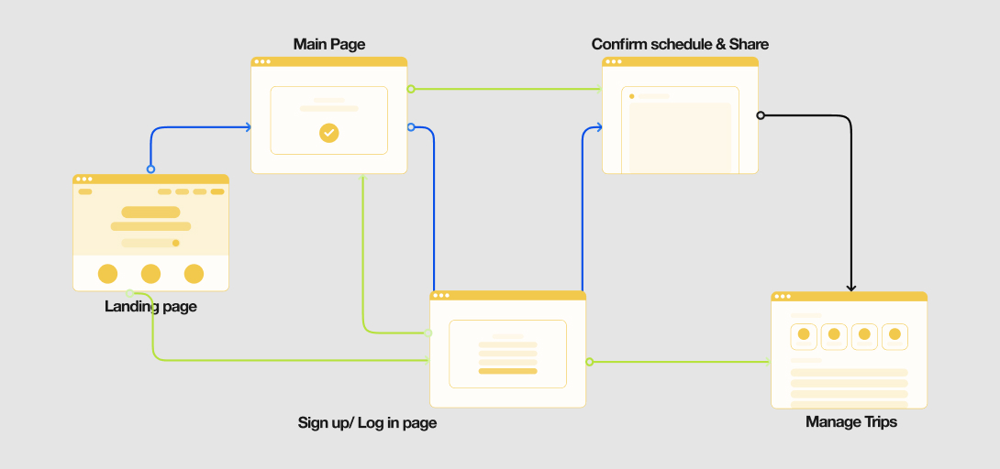

    
  

   An itinerary arrangement website aims to help travellers plan trips within minimum effort and time.
     
    <a href="https://iter-e3ef2.web.app/"><strong>View Website »</strong></a>
     
  
 

<kbd  align="center">
    
</kbd>

## Technologies

- Front-End Fundamentals
  - HTML
  - CSS
  - JavaScript (ES6)
  - Responsive Web Design
  - styled-components
- Front-End Frameworks
  - React (Hooks)
  - React Router
- Firebase
  - Firestore Database
  - Authentication
  - Hosting
- Third-Party Libraries
  - Mapbox (map)
  - Mapbox GL JS (marker & popup)
  - mapbox-gl-directions (transportation)
  - FullCalendar
  - Google Map Places API (Place Search)
  - SweetAlert 2
  - Reactjs-popup
  - React Joyride
  - react-to-print
  - react-share
- Web Crawler
  - Node.js
  - Request
  - Cheerio

## Recent Updates

- Complete manage page RWD
- Refactor to increase code-readability
- Fix bugs

## Flow Chart

## Demo

### Landing Page

- #### Play with Interactive Map

  Scroll to zoom in or out and drag to freely explore different areas of the world.
  <kbd>
  
  </kbd>

- #### View City Titles & Enter City Page

  Click to view city titles on markers, and then click arrow to enter city page
  <kbd>
  
  </kbd>

### City Page

- #### Tourist Attractions

  Scroll to explore popular tourist attractions recommended by ITER. Click attraction title to view more detail information.
  <kbd>
  
  </kbd>

  Drag the tourist attractions you'd like to visit to calendar. Arrange trip by simple actions.
  <kbd>
  
  </kbd>

- #### Transportation

  You can click any 2 points on the map to get auto-calculate transportation time, distance, and route in 3 different tranportation methods.
  <kbd>
  
  </kbd>

  You can also type in the input fileds to get transportation information between 2 points.
  <kbd>
  
  </kbd>

  Finally, you can drag the auto-calculate transportation method you'd like to take to the calendar to arrange your schedule.
  <kbd>
  
  </kbd>

- #### Calendar

  Besides the provided tourist attractions, you can create customized events as well with the "create event" button. Just type the date and title of the event.
  <kbd>
  
  </kbd>

  Remember to save your trip schedule after finish.
  <kbd>
  
  </kbd>

### Confirm Page

- #### Export Trip Schedule to PDF file or Print It Out
  - You can export trip schedule to PDF or print it out for more flexible and convinient usage, like carrying while traveling.
  - You can share trip shcedule to friends and families via various social media platforms.
    <kbd>
    
    </kbd>

## Future Features

- Add more cities
- Let users edit the titles of existing calendar events
- Show tourist attraction marker when hoverning on the attraction event (now is by clicking the marker itself)
- Add navigation part with animation to landing page
- Improve city page UI layout
- Let users customize event colors in confirm page

## Contact

Feel free to contact me if have further questions. 
E-mail: isabelleya927@gmail.com
